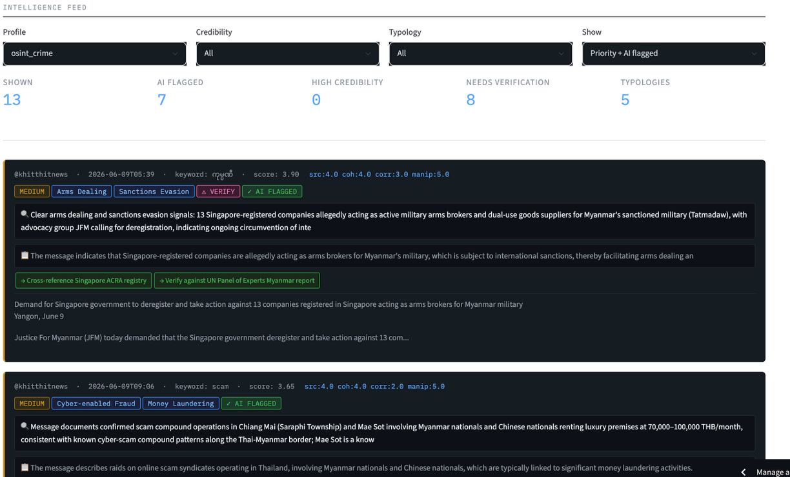
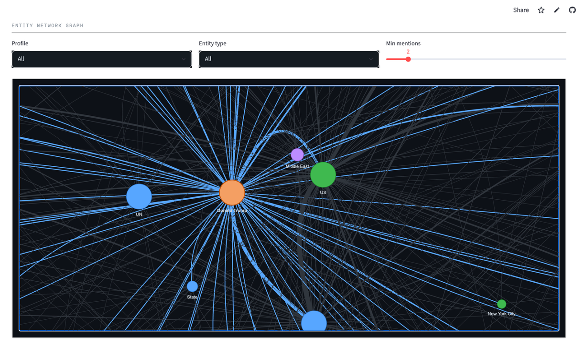
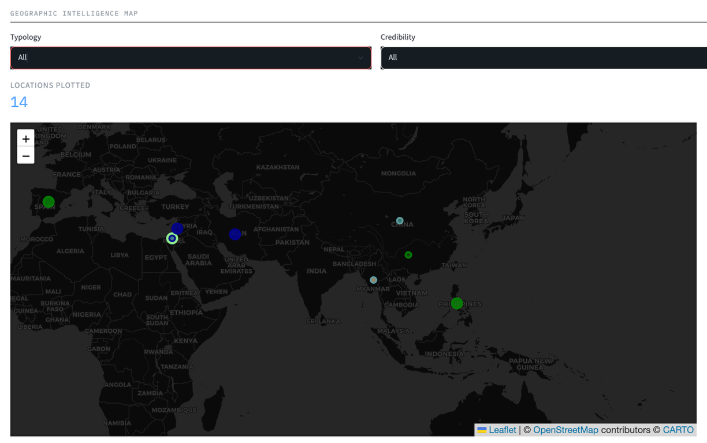
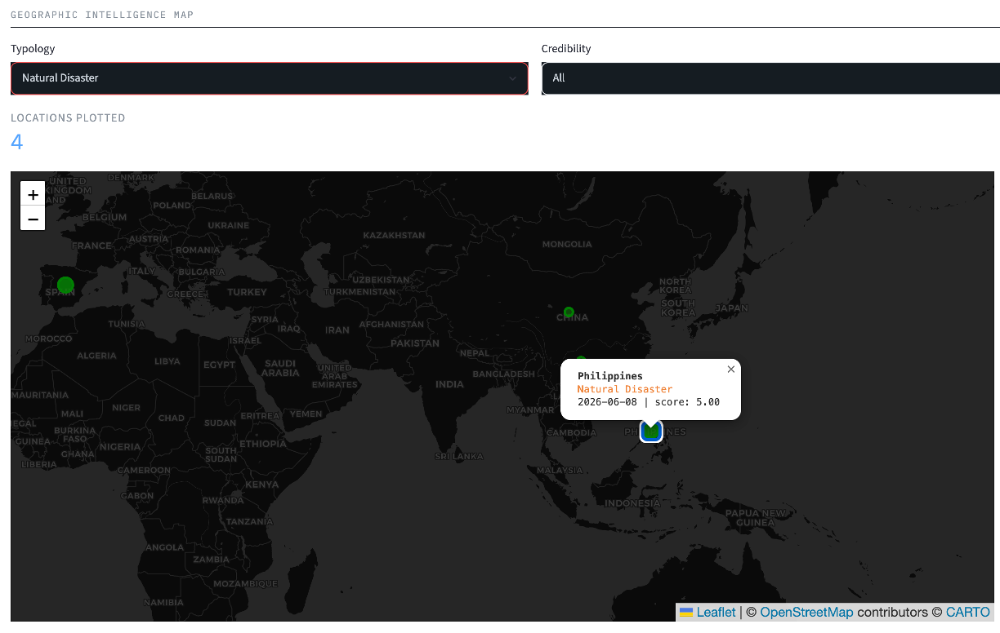
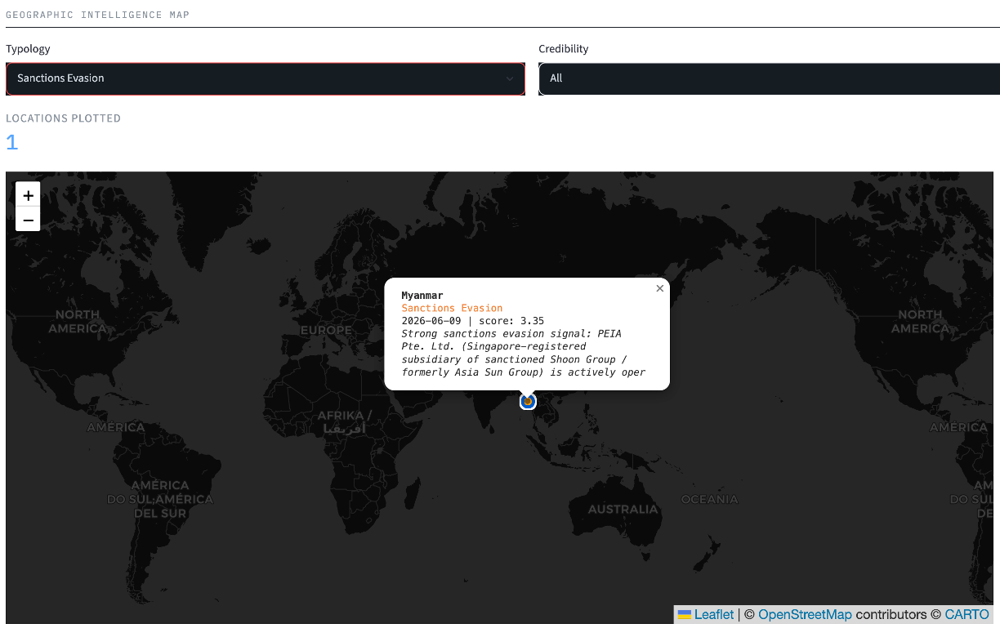

# OSINT Intelligence Platform

A multilingual real-time intelligence and monitoring platform for open-source data collection, AI-powered analysis and humanitarian situational awareness. Built for research and policy contexts including transnational organised crime, disaster response and public health surveillance.

**Live app:** [osint-dashboard-kxhsy4gvspevhvzvo36ah9.streamlit.app](https://osint-dashboard-kxhsy4gvspevhvzvo36ah9.streamlit.app)

---

## What it does

The platform ingests content from public Telegram channels and news sources, translates non-English content natively using AI, classifies each message against a 16-category intelligence typology, scores credibility on four dimensions and surfaces actionable analyst findings through a live dashboard.

**Currently monitoring:**
- Organised crime and sanctions evasion networks in Southeast Asia (Myanmar, Thailand, Singapore)
- Disaster response signals (Philippines M7.8 earthquake, June 2026)
- Public health surveillance (DRC/Uganda Ebola outbreak, WHO PHEIC)
- Humanitarian events and state actor activity across the Middle East and Africa

**What it can also monitor with channel list updates:**
- Trafficking recruitment networks and scam compound operations
- Cryptocurrency laundering and blockchain address tracking
- Terrorist financing and violent extremism signals
- Migration and displacement patterns
- Food security and agricultural stress
- Any public Telegram channel or news feed in any language

---

## Dashboard pages

### Intelligence Feed



The main analyst view. Shows all priority-flagged and AI-flagged messages sorted by composite credibility score. Each card displays the source channel, timestamp, matched keyword, four-dimension credibility scores (src / coh / corr / manip) and the AI analyst note explaining what was flagged and why. Filter by profile, credibility tier, typology or view mode.

**Credibility score dimensions:**
- `src` - Source reliability: track record and editorial standards of the channel (1-5)
- `coh` - Content coherence: whether the claims are specific, internally consistent and verifiable (1-5)
- `corr` - Corroboration: how many independent sources report the same claim (1-5)
- `manip` - Manipulation risk: indicators of coordinated inauthentic behaviour or disinformation (1-5, where 5 means lowest risk)

**Composite score:** weighted average of the four dimensions. 4.0 and above is high credibility. 2.5-3.99 is medium. Below 2.5 is low.

---

### Network Graph



Interactive entity relationship map. Each node is a named entity extracted from messages. The size of a node reflects how many times that entity appears across collected messages. Lines between nodes mean those entities appeared together in the same message. Blue highlighted lines show connections to the node you are hovering over.

**Node colours by entity type:**

| Colour | Code | Meaning |
|--------|------|---------|
| Orange | PERSON | A named individual (e.g. Min Aung Hlaing, Emmanuel Macron) |
| Blue | ORG | An organisation (e.g. Justice For Myanmar, Hamas, OCHA) |
| Green | GPE | Geopolitical entity - country, city or territory (e.g. Myanmar, Singapore, Gaza) |
| Purple | LOC | A physical location (e.g. Golden Triangle, Strait of Hormuz) |
| Gold/Yellow | NORP | Nationality, religious or political group (e.g. French, Israeli, Palestinian) |
| Pink | FAC | A facility or building (e.g. KK Park, a specific compound) |
| Light pink | EVENT | A named event (e.g. World Cup, Operation 9) |

**The table beneath the graph** shows the top entities by mention count. These are not keywords - they are named entities extracted from message text by a language model. An entity like PEIA Pte. Ltd. appearing repeatedly means that specific company name was mentioned across multiple messages, which is analytically significant for network mapping.

Filter by profile (e.g. osint_crime) to see the Myanmar/Singapore sanctions evasion network. Filter to disaster_response to see the geographic cluster around the Philippines earthquake.

---

### Geographic Map







Incident markers plotted at known locations extracted from classified messages. Click any marker for details including typology, credibility score and the AI analyst note. Filter by typology or credibility tier.

**Dot colours by typology:**

| Colour | Typology |
|--------|----------|
| Red | Arms Dealing |
| Orange | Sanctions Evasion / Scam Compound Operations |
| Dark red | Human Trafficking / Forced Labour |
| Blue-grey | Cyber-enabled Fraud |
| Purple | Money Laundering / Crypto Laundering |
| Dark purple | Terrorist Financing |
| Dark blue | State Actor / Military Activity |
| Green | Natural Disaster |
| Light green | Humanitarian Event |
| Blue | Public Health Event |
| Pink | Corruption |
| Grey | Disinformation |

Larger dots indicate higher credibility (high tier). Smaller dots are medium or low credibility signals.

---

### Briefing Generator

Select a monitoring profile, typology and credibility filter. The platform synthesises all matching classified messages into a structured intelligence brief with six sections: Executive Summary, Key Findings, Entity Analysis, Emerging Patterns, Recommended Actions and Verification Requirements. Download as a text file for distribution.

---

## Architecture

```
Telegram channels
       |
Module 1 - Ingestion and AI triage
  Language detection
  Claude/Nova translate + triage (non-English)
  NER entity extraction (spaCy)
  Crypto address detection
  SQLite database
       |
Module 2 - Classification and credibility scoring
  16-category typology classification (Amazon Nova Micro)
  Four-dimension credibility scoring
  Cross-message corroboration (sentence-transformers)
  Actionable flag generation
       |
Module 3 - Satellite enrichment (GEE)
  SAR flood mapping (Sentinel-1)
  Earthquake damage detection (SAR coherence)
  Compound construction monitoring (NDBI, Sentinel-2)
  NDVI anomaly detection (drought/food security)
       |
S3 (Parquet)
       |
Module 4 - Dashboard (this repo)
  Streamlit + Folium + PyVis + Amazon Nova Lite
```

**AI providers:** Amazon Bedrock (Nova Micro for classification, Nova Lite for translation and briefing generation)

**Data store:** AWS S3 (Parquet, synced after every ingestion run)

**Satellite:** Google Earth Engine

---

## Monitoring profiles

| Profile | Focus | Active channels |
|---------|-------|----------------|
| OSINT / Organised Crime | Scam compounds, arms dealing, sanctions evasion, Myanmar | MyanmarNowNews, bnionline, narinjara, khitthitnews |
| Disaster Response | Earthquakes, floods, cyclones, Philippines | abscbnnews, aljazeeraglobal, bbcworld |
| Public Health | Outbreaks, epidemics, PHEIC | aljazeeraglobal, bbcworld |
| Humanitarian / MEAL | Displacement, food insecurity, GBV | aljazeeraglobal, bbcworld |
| Migration | Border movements, Rohingya, irregular crossings | aljazeeraglobal, MyanmarNowNews |

---

## Intelligence typology

Messages are classified into one of 16 categories:

1. Human Trafficking and Smuggling
2. Forced Labour
3. Scam Compound Operations
4. Cyber-enabled Fraud
5. Arms Dealing
6. Sanctions Evasion
7. Money Laundering
8. Crypto Laundering
9. Terrorist Financing
10. State Actor / Military Activity
11. Corruption
12. Disinformation
13. Humanitarian Event
14. Natural Disaster
15. Public Health Event
16. Other / Unclassified

---

## Tech stack

- Python 3.12
- Streamlit (dashboard)
- Telethon (Telegram ingestion)
- Amazon Bedrock - Nova Micro and Nova Lite (AI classification and briefing)
- sentence-transformers (cross-message corroboration)
- spaCy en_core_web_sm (named entity recognition)
- Google Earth Engine (satellite enrichment)
- Folium and streamlit-folium (geographic map)
- PyVis (network graph)
- AWS S3 and PyArrow/Parquet (data storage)
- SQLite (local working database)

---

## Deployment

The dashboard reads all data from S3. No local database required on the server.

AWS credentials are stored as Streamlit Cloud secrets. For local development configure via `aws configure`.

To add new monitoring channels update the `PROFILES` dictionary in Module 1 Cell 3. To add new known locations for map plotting add coordinates to the `COORDS` dictionary in `app.py`.

---

## Related tools

This dashboard is part of a broader analytics portfolio. Other tools in the collection cover trade in services data visualisation (OECD BaTIS), satellite-derived economic activity monitoring (Ethiopia nightlights), mangrove ecosystem change detection and macroeconomic indicator dashboards.
